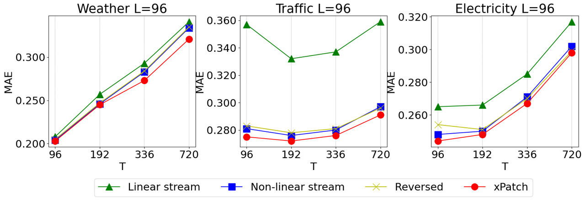

# xPatch 模型复现与代码解析 / xPatch Model Reproduction and Code Analysis

<div align="center">
  <h2><b>🔬 (AAAI25) xPatch 复现实现与架构解析 / Reproduction Implementation and Architecture Analysis</b></h2>
  <h3><b>📝 复现整理：Collin / Reproduced and Organized by: Collin</b></h3>
</div>

<div align="center">

[](https://arxiv.org/pdf/2412.17323)
[](https://ojs.aaai.org/index.php/AAAI/article/view/34270)
[]()
[]()

</div>

## 📝 项目简介 / Project Overview

**中文简介：**
本文档详细记录了对 AAAI 2025 论文 "[xPatch: Dual-Stream Time Series Forecasting with Exponential Seasonal-Trend Decomposition](https://arxiv.org/pdf/2412.17323)" 的模型复现过程和代码实现解析。xPatch 是一个基于双流架构的时间序列预测模型，通过分解时间序列为季节性和趋势性组件，并分别采用非线性流和线性流进行处理。本复现由 **Collin** 完成，包含完整的代码重构、架构解析和实现细节说明。

**English Overview:**
This document provides a detailed record of the model reproduction process and code implementation analysis for the AAAI 2025 paper "[xPatch: Dual-Stream Time Series Forecasting with Exponential Seasonal-Trend Decomposition](https://arxiv.org/pdf/2412.17323)". xPatch is a dual-stream architecture-based time series forecasting model that decomposes time series into seasonal and trend components, processing them separately with non-linear and linear streams. This reproduction was completed by **Collin**, including complete code refactoring, architecture analysis, and implementation details.

## 🌟 复现特性 / Reproduction Features

### 中文特性
- ✅ **完整重构**：基于论文架构图从零重新实现所有核心模块
- ✅ **模块化设计**：清晰的模块划分，每个组件职责明确
- ✅ **详细注释**：代码中包含丰富的中英文注释和维度标注
- ✅ **架构解析**：结合代码提供深入的架构设计思路分析
- ✅ **维度追踪**：完整的数据流维度变换过程记录
- ✅ **独立训练脚本**：专门为复现模型定制的训练脚本

### English Features
- ✅ **Complete Refactoring**: Reimplemented all core modules from scratch based on paper architecture diagrams
- ✅ **Modular Design**: Clear module separation with well-defined component responsibilities
- ✅ **Detailed Comments**: Rich bilingual comments and dimension annotations in code
- ✅ **Architecture Analysis**: In-depth analysis of architectural design concepts combined with code
- ✅ **Dimension Tracking**: Complete recording of data flow dimension transformation process
- ✅ **Independent Training Script**: Customized training script specifically for the reproduced model

## 🏗️ 模型架构概览 / Model Architecture Overview

xPatch 模型的整体架构可以分为以下几个主要部分：

The overall xPatch model architecture can be divided into the following main components:

1. **预处理层 / Preprocessing Layers**：RevIN 标准化和时间序列分解
2. **双流处理 / Dual-Stream Processing**：非线性流（处理季节性）和线性流（处理趋势性）
3. **后处理层 / Post-processing Layers**：流融合和反标准化

<p align="center">

</p>

## 📋 详细代码解析 / Detailed Code Analysis

### 1. 预处理层 / Preprocessing Layers

#### 1.1 RevIN 标准化 / RevIN Normalization

```python
# 1. Apply RevIN normalization if enabled
if self.revin:
    x = self.revin_layer(x,'norm')
```

**设计思路 / Design Concept:**
- **中文**：RevIN（Reversible Instance Normalization）是一种专门为时间序列设计的标准化技术，能够在保持时间序列特性的同时进行标准化处理，避免了传统标准化可能破坏时间依赖关系的问题。
- **English**: RevIN (Reversible Instance Normalization) is a normalization technique specifically designed for time series, capable of normalization while preserving time series characteristics, avoiding the issue of traditional normalization potentially disrupting temporal dependencies.

#### 1.2 时间序列分解 / Time Series Decomposition

```python
# 2. Decompose into seasonal and trend components. Input is 3D [B, L, C].
s,t = self.decomposition(x)
```

**关键创新 / Key Innovation:**
- **中文**：使用指数移动平均（EMA）或双指数移动平均（DEMA）将输入时间序列分解为季节性组件（s）和趋势性组件（t），这种分解方式相比传统方法能更好地捕获时间序列的周期性模式。
- **English**: Uses Exponential Moving Average (EMA) or Double Exponential Moving Average (DEMA) to decompose input time series into seasonal component (s) and trend component (t). This decomposition method captures periodic patterns better than traditional approaches.

### 2. 通道独立处理 / Channel Independence Processing

```python
# 3. Permute for channel independence: [B,L,C] -> [B,C,L]
s = s.permute(0,2,1)
t = t.permute(0,2,1)

# 4. Reshape for channel independence: [B,C,L] -> [B*C, L]
B, C, L = s.shape
s = s.reshape(B*C, L)
t = t.reshape(B*C, L)
```

**设计原理 / Design Principle:**
- **中文**：为了实现通道独立处理，将三维张量 `[批次, 长度, 通道]` 重构为二维张量 `[批次*通道, 长度]`，使每个变量都能独立处理，避免了不同变量间的不必要干扰。
- **English**: To achieve channel independence processing, reshapes 3D tensor `[Batch, Length, Channel]` into 2D tensor `[Batch*Channel, Length]`, allowing each variable to be processed independently and avoiding unnecessary interference between different variables.

### 3. 非线性流（Non-Linear Stream）

非线性流专门处理季节性组件，采用基于 Patch 的架构：

The non-linear stream specifically processes seasonal components using a Patch-based architecture:

#### 3.1 Patching 层 / Patching Layer

```python
class PathcingLayer(nn.Module):
    def __init__(self, seq_len:int, patch_len:int, stride:int, padding_patch:str):
        super().__init__()
        self.seq_len = seq_len # 序列长度
        self.patch_len = patch_len # 每个patch的长度
        self.stride = stride # 滑动窗口的长度
        self.padding_patch = padding_patch # 用于在patch中进行padding的符号
        self.dim = patch_len * patch_len # patchembedding dim
        self.patch_num = (seq_len - patch_len) // stride + 1 # patch的数量
        if padding_patch == 'end':
            self.padding_layer = nn.ReplicationPad1d((0,stride))
            self.patch_num += 1

    def forward(self,x):
        # step 3: Patching  [Batch*Channel, Input] -> [Batch*Channel, Patch_num,Patch_len]
        if self.padding_patch == 'end':
            x = self.padding_layer(x)
        x = x.unfold(dimension=-1, size=self.patch_len, step=self.stride)
        return x # [Batch*Channel, Patch_num,Patch_len]
```

**核心设计思想 / Core Design Philosophy:**
- **中文**：
  - 使用滑动窗口 `unfold` 操作将序列分割成重叠的 patches，类似于 Vision Transformer 的思想
  - `ReplicationPad1d` 在序列末尾进行填充，确保所有数据都被利用
  - 输出形状：`[B*C, patch_num, patch_len]`

- **English**:
  - Uses sliding window `unfold` operation to segment sequences into overlapping patches, similar to Vision Transformer concepts
  - `ReplicationPad1d` performs padding at sequence end to ensure all data is utilized
  - Output shape: `[B*C, patch_num, patch_len]`

#### 3.2 Patch 嵌入层 / Patch Embedding Layer

```python
class PatchingEmbedding(nn.Module):
    def __init__(self, patch_len:int, patch_num:int)->None:
        super().__init__()
        self.dim = patch_len * patch_len
        self.fc1 = nn.Linear(patch_len, self.dim)
        self.gelu = nn.GELU()
        self.bn1 = nn.BatchNorm1d(patch_num)

    def forward(self,x:torch.Tensor)->torch.Tensor:
        x = self.fc1(x) # [B*C, patch_num, patch_len] -> [B*C, patch_num, patch_len^2]
        x = self.gelu(x)
        x = self.bn1(x)
        return x
```

**设计亮点 / Design Highlights:**
- **中文**：
  - 将每个 patch 从 `patch_len` 维度映射到 `patch_len²` 维度，极大增加模型容量
  - 使用 GELU 激活函数提供更好的非线性表达能力
  - BatchNorm1d 确保训练稳定性

- **English**:
  - Maps each patch from `patch_len` dimension to `patch_len²` dimension, significantly increasing model capacity
  - Uses GELU activation function for better non-linear expression capability
  - BatchNorm1d ensures training stability

#### 3.3 残差连接块 / Residual Connection Block

```python
class ResidualBlock(nn.Module):
    def __init__(self, patch_num:int, patch_len:int )->None:
        super().__init__()
        # Instantiate the two parallel layers/streams that will be combined
        self.residual_layer=ResidualLayer(patch_len)
        self.depthwise_conv=DepthwiseConv(patch_num, patch_len)

    def forward(self,x:torch.Tensor)->torch.Tensor:
        # 1.Calculate the output of the residual stream
        residual_out=self.residual_layer(x)
        # 2.Calculate the output of the main depthwise convolution stream
        depthwise_out=self.depthwise_conv(x)
        # 3. Add the outputs of the two streams together
        output = residual_out + depthwise_out
        return output
```

**架构创新 / Architectural Innovation:**
- **中文**：
  - 结合残差连接和深度可分离卷积的设计思路
  - `ResidualLayer` 将高维嵌入投影回 `patch_len` 维度，提供跳跃连接
  - `DepthwiseConv` 使用分组卷积进行空间特征提取，减少参数量同时保持表达能力

- **English**:
  - Combines residual connection and depthwise separable convolution design concepts
  - `ResidualLayer` projects high-dimensional embedding back to `patch_len` dimension, providing skip connections
  - `DepthwiseConv` uses grouped convolution for spatial feature extraction, reducing parameters while maintaining expressiveness

#### 3.4 点卷积和 MLP 头 / Pointwise Convolution and MLP Head

```python
class PointwiseConv(nn.Module):
    def __init__(self,patch_num:int)->None:
        super().__init__()
        self.conv2 = nn.Conv1d(patch_num,patch_num,1,1)  # 1x1 卷积
        self.gelu = nn.GELU()
        self.bn3 = nn.BatchNorm1d(patch_num)

class MLPFlatten(nn.Module):
    def __init__(self,patch_num:int,patch_len:int,pred_len:int)->None:
        super().__init__()
        self.flatten = nn.Flatten(start_dim=-2)
        self.fc3 = nn.Linear(patch_num*patch_len, pred_len*2)
        self.gelu = nn.GELU()
        self.fc4 = nn.Linear(pred_len*2, pred_len)
```

**设计精髓 / Design Essence:**
- **中文**：
  - 点卷积（1x1卷积）进行通道间信息交互，增强特征表达
  - MLP 头将 patch 特征展平并通过两层全连接网络映射到预测长度
  - 中间层使用 `pred_len*2` 维度提供充分的特征变换空间

- **English**:
  - Pointwise convolution (1x1 convolution) for inter-channel information interaction, enhancing feature expression
  - MLP head flattens patch features and maps to prediction length through two-layer fully connected network
  - Intermediate layer uses `pred_len*2` dimension to provide sufficient feature transformation space

### 4. 线性流（Linear Stream）

线性流专门处理趋势性组件，采用简单而有效的 MLP 架构：

The linear stream specifically processes trend components using a simple yet effective MLP architecture:

```python
class LinearBlock(nn.Module):
    def __init__(self,seq_len:int,pred_len:int)->None:
        super().__init__()
        self.fc5 = nn.Linear(seq_len,pred_len*4)
        self.avgpool1 = nn.AvgPool1d(kernel_size=2)
        self.ln1 = nn.LayerNorm(pred_len*2)

        self.fc6 = nn.Linear(pred_len*2, pred_len)
        self.avgpool2 = nn.AvgPool1d(kernel_size=2)
        self.ln2 = nn.LayerNorm(pred_len//2)

        self.fc7 = nn.Linear(pred_len // 2, pred_len)

    def forward(self,x:torch.Tensor)->torch.Tensor:
        x = self.fc5(x)      # seq_len -> pred_len*4
        x = self.avgpool1(x) # pred_len*4 -> pred_len*2
        x = self.ln1(x)
        x = self.fc6(x)      # pred_len*2 -> pred_len
        x = self.avgpool2(x) # pred_len -> pred_len//2
        x = self.ln2(x)
        x = self.fc7(x)      # pred_len//2 -> pred_len
        return x
```

**设计哲学 / Design Philosophy:**
- **中文**：
  - 多层 MLP 结构，逐步降维处理趋势信息
  - 使用平均池化进行下采样，保持信息的平滑性
  - LayerNorm 提供正则化，适合处理平滑的趋势信号
  - 简单架构适配趋势数据的低频特性

- **English**:
  - Multi-layer MLP structure with gradual dimension reduction for trend information processing
  - Uses average pooling for downsampling to maintain information smoothness
  - LayerNorm provides regularization, suitable for processing smooth trend signals
  - Simple architecture adapts to low-frequency characteristics of trend data

### 5. 双流融合 / Dual-Stream Fusion

```python
# 5. Process through respective streams
s_pre = self.nonlinear_block(s) # -> [B*C, pred_len]
t_pre = self.linear_block(t)

# 6. Concatenate stream outputs
x_out = torch.cat((s_pre,t_pre),dim=1) #->[B*C, pred_len*2]

# 7. Final Projection
x_out = self.fc8(x_out) # -> [B*C, pred_len]
```

**融合策略 / Fusion Strategy:**
- **中文**：
  - 将两个流的输出在特征维度上连接，实现信息互补
  - 使用线性层将融合特征映射到最终预测维度
  - 简单而有效的融合方式，避免过度复杂化

- **English**:
  - Concatenates outputs from both streams in feature dimension for information complementarity
  - Uses linear layer to map fused features to final prediction dimension
  - Simple yet effective fusion approach, avoiding over-complication

### 6. 后处理与形状恢复 / Post-processing and Shape Recovery

```python
# 8. Reshape back to include channels: [B*C, pred_len] -> [B,C,pred_len]
x_out = x_out.reshape(B,C,self.pred_len)

# 9. Permute back to original format: [B,C,pred_len] -> [B,pred_len,C]
x_out = x_out.permute(0,2,1)

# 10. Apply RevIn denormalization to get the final prediction
if self.revin:
    x_out = self.revin_layer(x_out,'denorm')
return x_out
```

**恢复机制 / Recovery Mechanism:**
- **中文**：
  - 恢复原始的张量形状和维度顺序，确保输出格式一致性
  - 使用 RevIN 反标准化恢复原始数据范围和分布
  - 完整的数据流闭环，保证模型的端到端可训练性

- **English**:
  - Restores original tensor shape and dimension order to ensure output format consistency
  - Uses RevIN denormalization to restore original data range and distribution
  - Complete data flow closed loop ensuring end-to-end trainability of the model

## 🎯 模型初始化与配置 / Model Initialization and Configuration

```python
class XPatch(nn.Module):
    def __init__(self,seq_len:int, pred_len:int, enc_in:int, patch_len:int, stride:int,
                 alpha:float, ma_type:str="ema", beta:float=0.3, revin:bool=True)->None:
        super().__init__()
        self.pred_len=pred_len

        # 1. Instantiate pre-processing layers
        self.revin=revin
        self.revin_layer= RevIN(num_features=enc_in,affine=True,subtract_last=False)
        self.decomposition = DECOMP(ma_type=ma_type,alpha=alpha,beta=beta)

        # 2. Instantiate the two main network blocks
        self.nonlinear_block = NonLinearBlock(seq_len,patch_len,stride,pred_len)
        self.linear_block = LinearBlock(seq_len,pred_len)

        # 3. Streams Concatenation
        self.fc8 = nn.Linear(pred_len * 2, pred_len)
```

**参数配置说明 / Parameter Configuration Description:**

| 参数 / Parameter | 说明 / Description |
|:---:|:---|
| `seq_len` | 输入序列长度 / Input sequence length |
| `pred_len` | 预测序列长度 / Prediction sequence length |
| `enc_in` | 输入特征维度（变量数量）/ Input feature dimension (number of variables) |
| `patch_len` | Patch 长度 / Patch length |
| `stride` | 滑动窗口步长 / Sliding window stride |
| `alpha` | EMA 平滑系数 / EMA smoothing coefficient |
| `ma_type` | 移动平均类型（'ema', 'dema', 'reg'）/ Moving average type |
| `beta` | DEMA 二次平滑系数 / DEMA secondary smoothing coefficient |
| `revin` | 是否使用 RevIN 标准化 / Whether to use RevIN normalization |

## 🔬 关键创新点分析 / Key Innovation Analysis

### 1. 双流架构设计 / Dual-Stream Architecture Design

**中文分析：**
- **动机**：传统时间序列模型往往用同一套参数处理所有频率的信息，这可能导致高频和低频特征相互干扰
- **解决方案**：设计专门的非线性流处理高频季节性信号，线性流处理低频趋势信号
- **优势**：各自专注于最适合的频率范围，提高模型的表达能力和预测精度

**English Analysis:**
- **Motivation**: Traditional time series models often use the same set of parameters to process information of all frequencies, which may lead to interference between high-frequency and low-frequency features
- **Solution**: Design dedicated non-linear stream for high-frequency seasonal signals and linear stream for low-frequency trend signals
- **Advantage**: Each focuses on the most suitable frequency range, improving model expressiveness and prediction accuracy

### 2. Patch-based 处理机制 / Patch-based Processing Mechanism

**中文分析：**
- **灵感来源**：借鉴 Vision Transformer 中将图像分割成 patches 的思想
- **适配改进**：针对一维时间序列数据进行滑动窗口分割，保持时间连续性
- **计算优势**：降低序列长度维度的计算复杂度，提高训练效率

**English Analysis:**
- **Inspiration**: Borrows from Vision Transformer's idea of segmenting images into patches
- **Adaptation**: Applies sliding window segmentation for 1D time series data while maintaining temporal continuity
- **Computational Advantage**: Reduces computational complexity in sequence length dimension, improving training efficiency

### 3. 通道独立处理 / Channel Independence Processing

**中文分析：**
- **问题识别**：不同变量具有不同的统计特性和变化模式
- **设计思路**：通过 reshape 操作实现每个变量的独立处理
- **实际效果**：避免变量间的相互干扰，提高多变量预测的准确性

**English Analysis:**
- **Problem Identification**: Different variables have different statistical characteristics and variation patterns
- **Design Concept**: Achieves independent processing for each variable through reshape operations
- **Practical Effect**: Avoids interference between variables, improving accuracy of multivariate prediction

## 📊 数据流追踪 / Data Flow Tracking

### 完整的维度变换过程 / Complete Dimension Transformation Process

| 步骤 / Step | 操作 / Operation | 输入维度 / Input Dim | 输出维度 / Output Dim | 说明 / Description |
|:---:|:---|:---:|:---:|:---|
| 1 | RevIN 标准化 / RevIN Norm | `[B, L, C]` | `[B, L, C]` | 保持维度不变 / Dimension unchanged |
| 2 | 时间序列分解 / Decomposition | `[B, L, C]` | `[B, L, C]`, `[B, L, C]` | 分解为季节性和趋势性 / Decompose to seasonal and trend |
| 3 | Permute | `[B, L, C]` | `[B, C, L]` | 调整维度顺序 / Adjust dimension order |
| 4 | Reshape | `[B, C, L]` | `[B*C, L]` | 实现通道独立 / Achieve channel independence |
| 5 | Patching | `[B*C, L]` | `[B*C, N, P]` | 分割成 patches / Segment into patches |
| 6 | Patch Embedding | `[B*C, N, P]` | `[B*C, N, P²]` | 嵌入到高维空间 / Embed to high-dim space |
| 7 | 非线性处理 / Non-linear | `[B*C, N, P²]` | `[B*C, pred_len]` | 复杂特征提取 / Complex feature extraction |
| 8 | 线性处理 / Linear | `[B*C, L]` | `[B*C, pred_len]` | 简单趋势预测 / Simple trend prediction |
| 9 | 融合 / Fusion | `[B*C, pred_len*2]` | `[B*C, pred_len]` | 双流信息融合 / Dual-stream fusion |
| 10 | 恢复形状 / Reshape back | `[B*C, pred_len]` | `[B, pred_len, C]` | 恢复原始格式 / Restore original format |

## 🚀 使用说明 / Usage Instructions

### 模型实例化 / Model Instantiation

```python
from models.model import XPatch

# 创建模型实例 / Create model instance
model = XPatch(
    seq_len=96,          # 输入序列长度 / Input sequence length
    pred_len=96,         # 预测长度 / Prediction length  
    enc_in=8,            # 输入特征数 / Number of input features
    patch_len=16,        # Patch 长度 / Patch length
    stride=8,            # 步长 / Stride
    alpha=0.3,           # EMA 系数 / EMA coefficient
    ma_type='ema',       # 移动平均类型 / Moving average type
    beta=0.3,            # DEMA 系数 / DEMA coefficient
    revin=True           # 使用 RevIN / Use RevIN
)

# 前向传播示例 / Forward pass example
batch_size, seq_len, num_features = 32, 96, 8
x = torch.randn(batch_size, seq_len, num_features)
output = model(x)  # 输出形状: [32, 96, 8] / Output shape: [32, 96, 8]
```

### 训练脚本使用 / Training Script Usage

```bash
# 使用定制训练脚本 / Use custom training script
python train_exchange_model.py

# 带自定义参数 / With custom parameters
python train_exchange_model.py \
    --seq_len 96 \
    --pred_len 192 \
    --patch_len 16 \
    --stride 8 \
    --alpha 0.3 \
    --learning_rate 0.0001 \
    --train_epochs 100
```

## 🎯 模型优势与特点 / Model Advantages and Features

### 技术优势 / Technical Advantages

**中文优势：**
1. **计算效率**：Patch-based 处理降低了序列长度的计算复杂度
2. **表达能力**：双流架构能够同时捕获周期性和趋势性模式
3. **模型解释性**：明确的分解和处理流程使模型行为更可解释
4. **通用性**：通道独立处理使模型能够处理不同特性的多变量时间序列
5. **训练稳定性**：多种正则化技术确保训练过程的稳定性

**English Advantages:**
1. **Computational Efficiency**: Patch-based processing reduces computational complexity of sequence length
2. **Expressiveness**: Dual-stream architecture can simultaneously capture periodic and trend patterns
3. **Model Interpretability**: Clear decomposition and processing flow makes model behavior more interpretable
4. **Generality**: Channel independence processing enables model to handle multivariate time series with different characteristics
5. **Training Stability**: Multiple regularization techniques ensure stability of training process

### 适用场景 / Applicable Scenarios

- **金融时间序列**：股价、汇率等具有明显趋势和周期性的数据
- **能源预测**：电力负荷、可再生能源发电量预测
- **供应链管理**：需求预测、库存优化
- **IoT 传感器数据**：温度、湿度等环境监测数据

- **Financial Time Series**: Stock prices, exchange rates with obvious trends and periodicity
- **Energy Forecasting**: Power load, renewable energy generation forecasting
- **Supply Chain Management**: Demand forecasting, inventory optimization
- **IoT Sensor Data**: Temperature, humidity and other environmental monitoring data

## 🔧 实现细节与注意事项 / Implementation Details and Considerations

### 重要实现细节 / Important Implementation Details

**中文说明：**
1. **维度变换**：确保所有 permute 和 reshape 操作的维度对应正确
2. **设备兼容性**：在 MPS（Apple Silicon）设备上需要注意 float64 兼容性问题
3. **梯度计算**：`unfold` 操作在某些设备上的反向传播支持有限
4. **内存管理**：通道独立处理会增加内存使用，需要合理设置 batch_size

**English Notes:**
1. **Dimension Transformation**: Ensure correct dimension correspondence for all permute and reshape operations
2. **Device Compatibility**: Need to pay attention to float64 compatibility issues on MPS (Apple Silicon) devices
3. **Gradient Computation**: Limited backward propagation support for `unfold` operations on certain devices
4. **Memory Management**: Channel independence processing increases memory usage, need to set batch_size reasonably

### 调试建议 / Debugging Suggestions

```python
# 添加维度检查点 / Add dimension checkpoints
def debug_forward(self, x):
    print(f"Input shape: {x.shape}")
    
    # RevIN
    if self.revin:
        x = self.revin_layer(x, 'norm')
        print(f"After RevIN: {x.shape}")
    
    # Decomposition
    s, t = self.decomposition(x)
    print(f"After decomposition - s: {s.shape}, t: {t.shape}")
    
    # Channel independence
    s = s.permute(0,2,1).reshape(-1, s.shape[1])
    t = t.permute(0,2,1).reshape(-1, t.shape[1])
    print(f"After reshape - s: {s.shape}, t: {t.shape}")
    
    # Stream processing
    s_out = self.nonlinear_block(s)
    t_out = self.linear_block(t)
    print(f"Stream outputs - s: {s_out.shape}, t: {t_out.shape}")
    
    return s_out, t_out
```

## 📚 参考资料与致谢 / References and Acknowledgements

### 原始论文 / Original Paper
```bibtex
@inproceedings{stitsyuk2025xpatch,
  title={xPatch: Dual-Stream Time Series Forecasting with Exponential Seasonal-Trend Decomposition},
  author={Stitsyuk, Artyom and Choi, Jaesik},
  booktitle={Proceedings of the AAAI Conference on Artificial Intelligence},
  volume={39},
  number={19},
  pages={20601--20609},
  year={2025}
}
```

### 相关开源项目 / Related Open Source Projects
- [Time-Series-Library](https://github.com/thuml/Time-Series-Library)
- [PatchTST](https://github.com/yuqinie98/PatchTST)
- [Autoformer](https://github.com/thuml/Autoformer)

## 📧 联系方式 / Contact Information

**复现整理：Collin / Reproduced and Organized by: Collin**

如有任何关于复现实现的问题或建议，请通过以下方式联系：

For any questions or suggestions regarding the reproduction implementation, please contact via:

- **GitHub Issues**: [提交问题 / Submit Issue](https://github.com/awesome-ai-papers-reproduction/issues)
- **Email**: junnebailiu@gmail.com

---

<div align="center">
  <p><strong>🌟 本复现实现完全开源，欢迎学习交流！/ This reproduction implementation is fully open source, welcome to learn and exchange! 🌟</strong></p>
  <p><strong>📝 复现整理：Collin | 基于 AAAI 2025 xPatch 论文 / Reproduced by: Collin | Based on AAAI 2025 xPatch Paper</strong></p>
</div> 