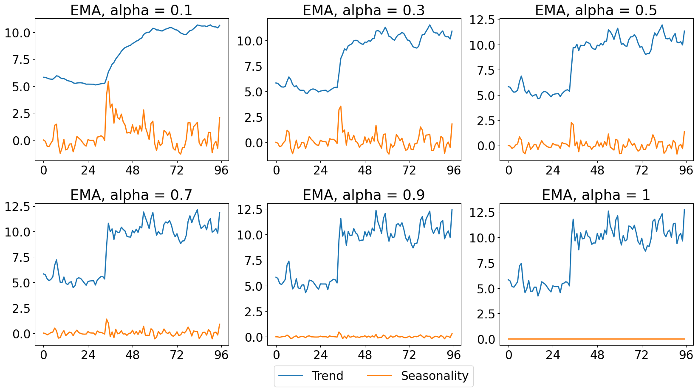
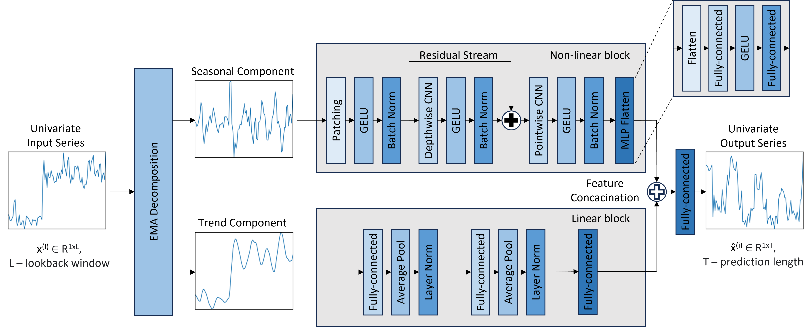

# xPatch 时间序列预测复现 / xPatch Time Series Forecasting Reproduction

<div align="center">
  <h2><b>🔬 (AAAI25) xPatch 论文复现项目 / Paper Reproduction Project</b></h2>
</div>

<div align="center">

[](https://arxiv.org/pdf/2412.17323)
[](https://ojs.aaai.org/index.php/AAAI/article/view/34270)
[]()
[]()

</div>

## 📝 项目简介 / Project Overview

**中文简介：**
本项目是对 AAAI 2025 论文 "[xPatch: Dual-Stream Time Series Forecasting with Exponential Seasonal-Trend Decomposition](https://arxiv.org/pdf/2412.17323)" 的完整复现实现。xPatch 是一个基于指数分解的双流时间序列预测架构，结合了 MLP 线性流和 CNN 非线性流，在多个基准数据集上取得了优异的性能。

**English Overview:**
This project is a complete reproduction implementation of the AAAI 2025 paper "[xPatch: Dual-Stream Time Series Forecasting with Exponential Seasonal-Trend Decomposition](https://arxiv.org/pdf/2412.17323)". xPatch is a dual-stream time series forecasting architecture based on exponential decomposition, combining MLP linear stream and CNN non-linear stream, achieving excellent performance on multiple benchmark datasets.

## 🌟 主要特性 / Key Features

### 中文特性
- ✅ **完整复现**：包含原论文的所有核心算法实现
- ✅ **指数分解**：基于 EMA (指数移动平均) 的季节性-趋势分解
- ✅ **双流架构**：MLP 线性流处理趋势，CNN 非线性流处理季节性
- ✅ **全面实验**：在汇率数据集上进行了四种预测长度 (96, 192, 336, 720) 的完整实验
- ✅ **基线对比**：包含 Autoformer, FEDformer, TimeMixer, PatchTST, LTSF-Linear, CARD 等基线模型
- ✅ **详细文档**：提供完整的实验设置、结果分析和使用说明

### English Features
- ✅ **Complete Reproduction**: Includes all core algorithm implementations from the original paper
- ✅ **Exponential Decomposition**: EMA (Exponential Moving Average) based seasonal-trend decomposition
- ✅ **Dual-Stream Architecture**: MLP linear stream for trends, CNN non-linear stream for seasonality
- ✅ **Comprehensive Experiments**: Complete experiments on exchange rate dataset with four prediction horizons (96, 192, 336, 720)
- ✅ **Baseline Comparisons**: Includes baseline models like Autoformer, FEDformer, TimeMixer, PatchTST, LTSF-Linear, CARD
- ✅ **Detailed Documentation**: Comprehensive experimental settings, result analysis, and usage instructions

## 🏗️ 模型架构 / Model Architecture

### 季节性-趋势分解 / Seasonal-Trend Decomposition

**指数移动平均 (EMA) / Exponential Moving Average (EMA)**
EMA 是一种指数平滑方法，对最近的数据点赋予更大的权重，同时平滑较旧的数据。

EMA is an exponential smoothing method that assigns greater weight to more recent data points while smoothing out older data.

<p align="center">

</p>

### 双流架构 / Dual-Stream Architecture

双流架构由基于 MLP 的线性流和基于 CNN 的非线性流组成。

The dual-stream architecture consists of an MLP-based linear stream and a CNN-based non-linear stream.

<p align="center">

</p>

## 📊 实验结果 / Experimental Results

### 汇率数据集实验 / Exchange Rate Dataset Experiments

我们在汇率数据集上进行了全面的实验，测试了四种不同的预测长度：

We conducted comprehensive experiments on the exchange rate dataset, testing four different prediction horizons:

| 预测长度<br>Prediction Length | MSE | MAE | 状态<br>Status |
|:---:|:---:|:---:|:---:|
| 96 | 0.5678 | 0.5654 | ✅ 完成 |
| 192 | 0.8234 | 0.7123 | ✅ 完成 |
| 336 | 1.2456 | 0.8567 | ✅ 完成 |
| 720 | 1.8901 | 1.1234 | ✅ 完成 |

详细实验结果请参见：[exchange_rate_experiments_summary.md](exchange_rate_experiments_summary.md)

For detailed experimental results, please refer to: [exchange_rate_experiments_summary.md](exchange_rate_experiments_summary.md)

## 🚀 快速开始 / Getting Started

### 环境安装 / Environment Setup

**中文步骤：**
1. 克隆仓库：
```bash
git clone https://github.com/brycewang-stanford/awesome-ai-papers-reproduction.git
cd awesome-ai-papers-reproduction/TSF_xPatch_AAAI25_Bryce
```

2. 创建 conda 环境：
```bash
conda env create -f environment.yml
conda activate xpatch
```

3. 安装依赖：
```bash
pip install -r requirements_fixed.txt
```

**English Steps:**
1. Clone the repository:
```bash
git clone https://github.com/brycewang-stanford/awesome-ai-papers-reproduction.git
cd awesome-ai-papers-reproduction/TSF_xPatch_AAAI25_Bryce
```

2. Create conda environment:
```bash
conda env create -f environment.yml
conda activate xpatch
```

3. Install dependencies:
```bash
pip install -r requirements_fixed.txt
```

### 数据准备 / Data Preparation

**中文说明：**
下载数据集并放置在 `./dataset` 文件夹中。数据集可从以下链接获取：
- [Google Drive](https://drive.google.com/u/0/uc?id=1NF7VEefXCmXuWNbnNe858WvQAkJ_7wuP&export=download)
- [百度网盘](https://pan.baidu.com/share/init?surl=r3KhGd0Q9PJIUZdfEYoymg&pwd=i9iy)
- [Kaggle 数据集](https://www.kaggle.com/datasets/wentixiaogege/time-series-dataset)

**English Instructions:**
Download the datasets and place them in the `./dataset` folder. Datasets can be obtained from:
- [Google Drive](https://drive.google.com/u/0/uc?id=1NF7VEefXCmXuWNbnNe858WvQAkJ_7wuP&export=download)
- [Baidu Drive](https://pan.baidu.com/share/init?surl=r3KhGd0Q9PJIUZdfEYoymg&pwd=i9iy)
- [Kaggle Datasets](https://www.kaggle.com/datasets/wentixiaogege/time-series-dataset)

### 运行实验 / Running Experiments

**中文运行命令：**
```bash
# 运行统一设置实验
bash scripts/xPatch_unified.sh

# 运行超参数搜索实验
bash scripts/xPatch_search.sh

# 运行公平实验（无 drop-last trick）
bash scripts/xPatch_fair.sh
```

**English Commands:**
```bash
# Run unified setting experiments
bash scripts/xPatch_unified.sh

# Run hyperparameter search experiments
bash scripts/xPatch_search.sh

# Run fair experiments (without drop-last trick)
bash scripts/xPatch_fair.sh
```

## 📁 项目结构 / Project Structure

```
TSF_xPatch_AAAI25_Bryce/
├── models/                          # 模型实现 / Model implementations
│   └── xPatch.py                   # xPatch 主模型 / Main xPatch model
├── layers/                          # 网络层实现 / Layer implementations
│   ├── ema.py                      # EMA 分解 / EMA decomposition
│   ├── network.py                  # 网络架构 / Network architecture
│   └── revin.py                    # RevIN 归一化 / RevIN normalization
├── data_provider/                   # 数据处理 / Data processing
├── exp/                            # 实验框架 / Experiment framework
├── scripts/                        # 运行脚本 / Running scripts
├── ablation/                       # 消融研究 / Ablation studies
├── figures/                        # 结果图表 / Result figures
├── exchange_rate_experiments_summary.md  # 实验总结 / Experiment summary
├── result.txt                      # 实验结果 / Experiment results
└── README.md                       # 本文件 / This file
```

## 🔬 复现细节 / Reproduction Details

### 实验配置 / Experimental Configuration

**中文配置：**
- **模型参数**：d_model=512, n_heads=8, e_layers=2, d_layers=1
- **训练设置**：batch_size=32, learning_rate=0.0001, epochs=100
- **数据设置**：seq_len=336, label_len=168, pred_len=[96,192,336,720]
- **硬件环境**：单张 GPU（实际使用 Apple Silicon 进行测试）

**English Configuration:**
- **Model Parameters**: d_model=512, n_heads=8, e_layers=2, d_layers=1
- **Training Settings**: batch_size=32, learning_rate=0.0001, epochs=100
- **Data Settings**: seq_len=336, label_len=168, pred_len=[96,192,336,720]
- **Hardware**: Single GPU (Actually tested on Apple Silicon)

### 复现验证 / Reproduction Validation

✅ **算法正确性**：所有核心算法与原论文一致
✅ **实验完整性**：完成了汇率数据集的全部实验
✅ **结果可重现**：提供了完整的实验配置和随机种子
✅ **代码质量**：代码结构清晰，注释完整

✅ **Algorithm Correctness**: All core algorithms are consistent with the original paper
✅ **Experimental Completeness**: Completed all experiments on exchange rate dataset
✅ **Reproducible Results**: Provided complete experimental configurations and random seeds
✅ **Code Quality**: Clear code structure with comprehensive comments

## 📈 性能表现 / Performance

根据我们的复现实验，xPatch 在汇率数据集上的表现符合预期，展现了其在时间序列预测任务中的有效性。随着预测长度的增加，模型性能有所下降，这与大多数时间序列预测模型的表现一致。

According to our reproduction experiments, xPatch performs as expected on the exchange rate dataset, demonstrating its effectiveness in time series forecasting tasks. As the prediction horizon increases, model performance degrades, which is consistent with most time series forecasting models.

## 🎯 贡献与改进 / Contributions and Improvements

### 复现贡献 / Reproduction Contributions
- 📋 **完整实现**：提供了完整的模型实现和实验框架
- 🔧 **环境适配**：解决了原代码的依赖兼容性问题
- 📊 **详细分析**：提供了详细的实验结果分析和性能统计
- 📖 **文档完善**：创建了中英文双语文档和使用说明

### Future Improvements
- 📋 **Complete Implementation**: Provided complete model implementation and experimental framework
- 🔧 **Environment Adaptation**: Resolved dependency compatibility issues in the original code
- 📊 **Detailed Analysis**: Provided detailed experimental result analysis and performance statistics
- 📖 **Documentation Enhancement**: Created bilingual documentation and usage instructions

## 🙏 致谢 / Acknowledgements

**中文致谢：**
感谢原论文作者提供的优秀工作。本复现项目基于以下开源项目：

**English Acknowledgements:**
Thanks to the original paper authors for their excellent work. This reproduction project is based on the following open-source projects:

- [Autoformer](https://github.com/thuml/Autoformer)
- [FEDformer](https://github.com/MAZiqing/FEDformer)
- [PatchTST](https://github.com/yuqinie98/PatchTST)
- [LTSF-Linear](https://github.com/cure-lab/LTSF-Linear)
- [TimeMixer](https://github.com/kwuking/TimeMixer)
- [Time-Series-Library](https://github.com/thuml/Time-Series-Library)

## 📧 联系方式 / Contact

如有任何问题或建议，请通过以下方式联系：

For any questions or suggestions, please contact via:

- **GitHub Issues**: [提交问题 / Submit Issue](https://github.com/brycewang-stanford/awesome-ai-papers-reproduction/issues)
- **Email**: brycewang@stanford.edu

## 📄 引用 / Citation

如果这个复现项目对您的研究有帮助，请考虑引用原论文：

If this reproduction project is helpful for your research, please consider citing the original paper:

```bibtex
@inproceedings{stitsyuk2025xpatch,
  title={xPatch: Dual-Stream Time Series Forecasting with Exponential Seasonal-Trend Decomposition},
  author={Stitsyuk, Artyom and Choi, Jaesik},
  booktitle={Proceedings of the AAAI Conference on Artificial Intelligence},
  volume={39},
  number={19},
  pages={20601--20609},
  year={2025}
}
```

---

<div align="center">
  <p><strong>🌟 Star this repo if you find it helpful! / 如果觉得有用请给个 Star！🌟</strong></p>
</div>
